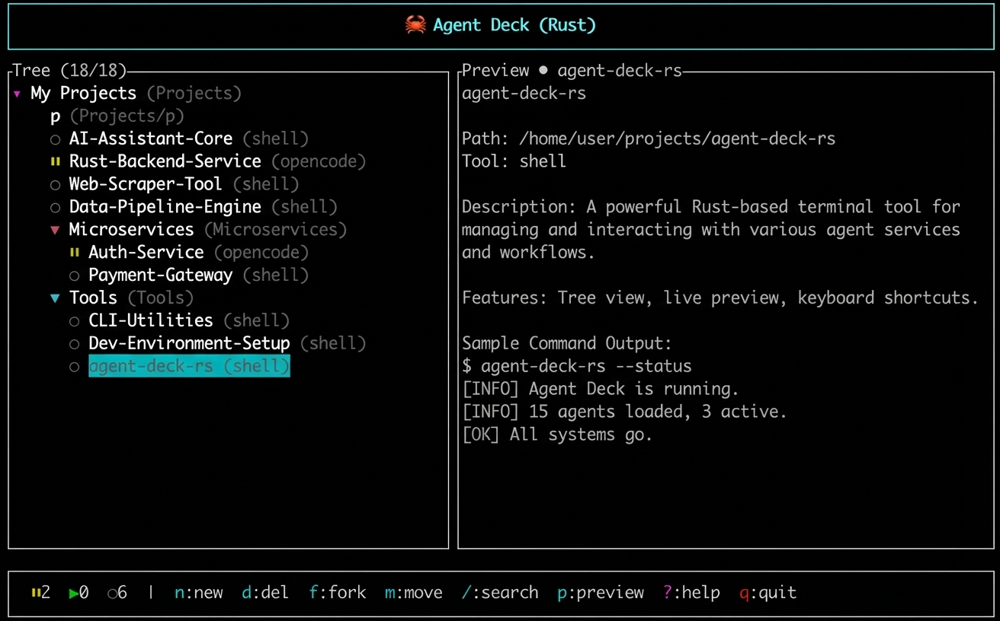

# 🦀 Agent Hand

> English: [README.md](README.md)

**多开 AI agent 窗口做 vibecoding 时很容易乱套？Agent Hand 帮你管理。**

一个基于 tmux 的快速终端会话管理器，用于 AI 编程代理（Claude / Copilot / OpenCode 等）。



## Why Agent Hand?

当你同时跑多个 AI agent（Claude、Copilot、OpenCode 等）做 vibecoding 时：
- 🤯 窗口太多，不知道哪个在等你确认、哪个跑完了
- 🔄 切来切去找不到刚才那个 session
- 😵 错过了 agent 的确认提示，白白等了半天

Agent Hand 解决这些问题：

| 状态图标 | 含义 | 你需要做什么 |
|---------|------|-------------|
| `!` 蓝色闪烁 | **需要确认** - agent 在等待你输入（确认/选择/批准/y/n 等） | 赶紧去看！ |
| `●` 黄色动画 | **正在运行** - agent 在思考/执行 | 可以先做别的 |
| `✓` 青色 | **刚跑完** - 约40分钟内完成（可配置） | 去看看结果 |
| `○` 灰色 | **空闲** - 还没启动或已经看过了 | 随时可以继续 |

说明：
- **刚跑完** 是派生状态：`空闲` + “最近跑过”（TTL 由 `ready_ttl_minutes` 控制）。
- **需要确认/正在运行** 来自对 tmux pane 最近输出的检测；可通过配置里的 `status_detection` 扩展规则。

## Agent Hand 的由来

2025 年初，我同时在跑 **5+ 个 Claude Code 实例**做不同的项目。那叫一个乱：

- 四个终端窗口，每个 3-4 个 tmux pane
- "我刚才确认那个提示了吗？"
- "哪个 Claude 在做哪个任务？"
- 光找对 session 就花了 10+ 分钟

我需要一个工具能够：
- **一目了然**看到哪些 session 需要处理
- **瞬间跳转**到最紧急的 session（Ctrl+N 优先级跳转）
- **快速切换**到任意 session（Ctrl+G 模糊搜索）
- **不干扰工作流**，用专用 tmux server 隔离

所以我用 Rust 造了 Agent Hand —— 一个专门解决这个问题的 TUI。

> *"最好的工具，是你会真正去用的那个。"*

## 核心亮点

### 🦀 Rust 驱动的高性能
- **启动 < 50ms** — 几乎瞬间完成
- **内存 ~8MB** — 轻量级
- **二进制 2.7MB** — 单文件，无运行时依赖

### 🎯 智能优先级跳转
- **Ctrl+N** 瞬间跳转到最紧急的 session (! 待确认 → ✓ 刚完成)
- 再也不会错过确认提示

### 🔍 闪电般快速切换
- **Ctrl+G** 模糊搜索弹窗 — 毫秒级定位任意 session
- 敲几个字符，直接跳转

### 📊 资源使用感知
- 实时监控每个 session 的 PTY（伪终端）数量
- 系统级 PTY 仪表板，红黄绿颜色预警
- 在 PTY 耗尽前预警

### 🔒 隔离设计
- **专用 tmux server** (`agentdeck_rs`) — 绝不干扰你的默认 tmux
- 你的配置、你的 sessions、你的工作流

### 🔌 可扩展
- 基于正则的状态检测 — 兼容任何 agent（Claude、Copilot、OpenCode、自定义提示词）
- 自定义快捷键 — 适应你的肌肉记忆

- **一目了然的状态列表**：所有 session 的状态实时显示
- **快速跳转**：`Ctrl+G` 弹出搜索框，秒切到任意 session
- **TUI dashboard**：运行 `agent-hand` 统一管理
- **分组管理**：按项目/用途组织你的 session
- **Session 标签**：自定义标题和颜色标签
- **tmux 加持**：`Ctrl+Q` 一键回 dashboard
- **自动升级**：`agent-hand upgrade`

## Install

### One-liner (recommended)

macOS / Linux / WSL：

```bash
curl -fsSL https://raw.githubusercontent.com/weykon/agent-hand/master/install.sh | bash
```

Windows：

- **推荐（WSL）**：请在 WSL 里执行上面的 macOS/Linux one-liner。
- **PowerShell 原生安装（进阶）**：仅适用于你已经有可用的 `tmux`（例如 MSYS2/Cygwin）的情况。

```powershell
powershell -ExecutionPolicy Bypass -c "iwr -useb https://raw.githubusercontent.com/weykon/agent-hand/master/install.ps1 | iex"
```

By default it installs to `/usr/local/bin` (if writable), otherwise `~/.local/bin`.

### Build from source

```bash
git clone https://github.com/weykon/agent-hand.git agent-hand
cd agent-hand
cargo build --release

# optional
cargo install --path .
```

## 状态检测自定义（可选）

可以通过自定义子串或正则来扩展 **需要确认/正在运行** 的检测规则。

```json
{
  "status_detection": {
    "prompt_contains": ["press enter to confirm", "esc to cancel"],
    "prompt_regex": ["confirm\\s+with\\s+enter"],
    "busy_contains": ["thinking..."],
    "busy_regex": ["\\bprocessing\\b"]
  }
}
```

## Quickstart

```bash
# open the TUI dashboard
agent-hand
```

From the dashboard:
- `n` 创建会话
- `Enter` 连接
- 在 tmux 中: `Ctrl+Q` 脱离回到面板  
- 在 tmux 中: `Ctrl+G` 弹窗 → 搜索 + 切换到其他会话
- 在 tmux 中: `Ctrl+N` **跳转到优先级会话** (🔵! → 🟢✓)

## Keybindings (TUI)

- Navigation: `↑/↓` or `j/k`, `Space` toggle expand/collapse group
- Session selected: `Enter` attach, `s` start, `x` stop, `r` edit (title/label), `t` tag, `R` restart, `m` move, `f` fork, `d` delete
- Group selected: `Enter` toggle, `g` create, `r` rename, `d` delete (empty = delete immediately; non-empty = confirm options)
- Global: `/` search, `p` capture preview snapshot, `?` help

## 自定义快捷键

启动时会读取 `~/.agent-hand/config.json`（也兼容旧目录 `~/.agent-deck-rs/config.json`）。

示例：

```json
{
  "keybindings": {
    "quit": ["q", "Ctrl+c"],
    "up": ["Up", "k"],
    "down": ["Down", "j"],

    "select": "Enter",
    "toggle_group": "Space",
    "expand": "Right",
    "collapse": "Left",

    "new_session": "n",
    "refresh": "Ctrl+r",
    "search": "/",
    "help": "?",

    "start": "s",
    "stop": "x",
    "rename": "r",
    "restart": "R",
    "delete": "d",
    "fork": "f",
    "create_group": "g",
    "move": "m",
    "tag": "t",
    "preview_refresh": "p"
  }
}
```

支持的按键名：`Enter` / `Esc` / `Tab` / `Backspace` / `Space` / `Up` / `Down` / `Left` / `Right`，以及单个字符（如 `r`、`R`、`/`）。
修饰键：`Ctrl+` / `Alt+` / `Shift+`。

注意：目前仅影响主 dashboard（Normal 模式）；其它对话框仍使用固定按键。

### tmux 热键（Ctrl+G / Ctrl+Q）

这两个热键绑定在 agent-hand 的 **专用 tmux server**（`tmux -L agentdeck_rs`）上，不会影响你默认的 tmux server。

在 `~/.agent-hand/config.json` 增加：

```json
{
  "tmux": {
    "switcher": "Ctrl+g",
    "detach": "Ctrl+q"
  }
}
```

配置会在下次 attach 时生效（agent-hand 会在 attach 时重绑按键）。

关于“冲突/被覆盖”的说明：
- 有些按键在终端里**本质等价**（例如 `Ctrl+i` ≈ `Tab`，`Ctrl+m` ≈ `Enter`，`Ctrl+[` ≈ `Esc`），选这些时可能看起来“没生效”。
- 也可能被 tmux / 终端 / 应用自身的快捷键**抢先绑定**。
- 建议优先使用默认的 `Ctrl+G` / `Ctrl+Q`（已经验证过、是比较好的选择）；如果要自定义，发现不生效就换一个组合，并用下面命令确认当前 tmux 绑定：
  `tmux -L agentdeck_rs list-keys -T root`

如果你之前使用的是旧目录 `~/.agent-deck-rs/`，当 agent-hand 检测到新目录 `~/.agent-hand/` 里还没有任何 session 时，会在启动时自动把旧 profiles 迁移到新目录。

## CLI

```bash
# add a session (optional --cmd runs when starting the tmux session)
agent-hand add . -t "My Project" -g "work/demo" -c "claude"

# list sessions
agent-hand list

# status overview
agent-hand status -v

# start / attach
agent-hand session start <id>
agent-hand session attach <id>

# upgrade from GitHub Releases
agent-hand upgrade
```

## Notes

- Agent Hand uses a **dedicated tmux server** (`tmux -L agentdeck_rs`) so it won’t touch your default tmux.
- 该专用 tmux server 的 copy-mode 默认使用 `mode-keys vi`（可配置：`tmux.copy_mode = "emacs"|"off"`）。
- tmux preview capture is intentionally **cached by default**; press `p` to refresh the snapshot when needed.
- Global config lives under `~/.agent-hand/` (legacy `~/.agent-deck-rs/` is still accepted).


### tmux 基础速查（搜索/复制/粘贴）

Agent Hand 底层是 tmux，所以会建议你掌握几个最常用的 tmux 操作（默认前缀键是 `Ctrl+b`）：

- 进入复制/滚动/搜索模式：`Ctrl+b` 然后按 `[`
- 在复制模式里搜索：`/` 输入关键词 `Enter`；跳转：`n` / `N`
- 复制选区（agent-hand 默认 `mode-keys vi`）：`v`/`Space` 开始选区，`y`/`Enter` 复制
  - 如果你更喜欢 emacs 模式，可以设置 `tmux.copy_mode = "emacs"`。
- 粘贴：`Ctrl+b` 然后按 `]`

小提示：agent-hand 在专用 tmux server 上默认开启了 mouse 模式，很多情况下可以直接用鼠标滚轮滚动。

## Changelog

See [CHANGELOG.md](CHANGELOG.md).

## License

MIT
